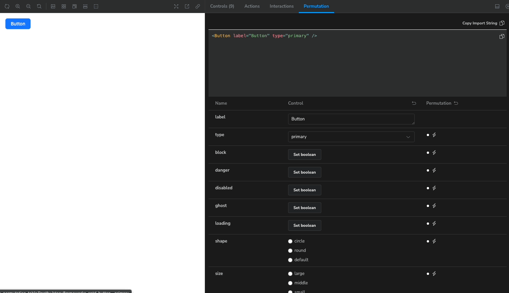

<div align="center">
  
  <h1>sb-addon-permutation-table</h1>
  <span></span>
  <span></span>
  <span></span>
  <div>
  <strong><a href="./README.ko.md" target="_blank">Korean</a></strong> |
  <strong><a href="https://daimresearch.github.io/sb-addon-permutation-table/?path=/docs/introduction--docs" target="_blank">Demos</a></strong>
  </div>
</div>
<hr/>

- **Disclaimer: This is only guaranteed to work with React-based projects. Other frameworks may introduce unintended errors.**
- **Typescript only Project. We don't have a plan to support Javascript**



This project is an addon that provides additional functionality to Storybook. In a separate panel, you can see the various aspects of the component as a table.

This project was highly inspired by Datadog's design system, [DRUIDS](https://druids.datadoghq.com/), and we wanted to use the Component Permutation feature from DRUIDS in Storybook.

## Table of contents

- [Feature](#feature)
- [Installation](#installation)
  - [Requirements](#requirements)
- [Why should I use it?](#why-should-i-use-it)
- [Usage](#usage)
  - [Advance](#advance)
- [Third-party libs](#third-party-libs)
- [Demos](#demos)
- [License](#license)

### Feature

- `Argument Control` : Manipulate the properties of your component directly. You can see what your component looks like in context.

- `Permutation` : Provide a table of different views with combinations of properties. Compare and analyze the results of combinations at a glance.

### Installation

`yarn add sb-addon-permutation-table`

#### Requirements

- `Storybook >= 7.x`
- `node >= 16.x`

### Why should I use it?

`sb-addon-permutation` provides a quick glance of complex, multi-property component views. Developers will be able to debug and test components efficiently through the showcase provided.

### Usage

Add addon code in `.stories/main.ts` like below.

```typescript
import type { StorybookConfig } from "@storybook/react-vite";
const config: StorybookConfig = {
  stories: ["../src/**/*.mdx", "../src/**/*.stories.@(js|jsx|ts|tsx)"],
  addons: ["sb-addon-permutation-table"],
  framework: {
    name: "@storybook/react-vite",
    options: {},
  },
  docs: {
    autodocs: "tag",
  },
};

export default config;
```

After that, you'll need to pass arguments to each story to use the addon's features.

For convenience, you can use the `PermutationMeta` type in your stories.

```typescript
// stories/Component.stories.(ts|tsx)

import React from "react";
import { PermutationMeta } from "sb-addon-permutation-table";
import YourComponent from "YourComponent";

const meta: PermutationMeta<typeof YourComponent> = {
  //...
  parameters: {
    storySource: {
      source: <YourComponent />, // type what your component looks like
      importPath: "import YourComponent from 'yourpackage", // import path of packaged component
    },
    permutation: {
      scope: {
        YourComponent, // add component here
      },
    },
  },
};
```

The addon will automatically use your component's type and make it available in the Permutation Panel.

If you have a property that you don't want to use Permutation for, you can pass the name of that property to deactivate.

```typescript
const meta: PermutationMeta<typeof YourComponent> = {
  //...
  parameters: {
    storySource: {
      source: <YourComponent />, // type what your component looks like
      importPath: "import YourComponent from 'yourpackage", // import path of packaged component
    },
    permutation: {
      scope: {
        YourComponent, // add component here
      },
      deactivate: ["foo", "bar"], // now property "foo" and "bar" disabled.
    },
  },
};
```

You can also apply them individually on a story by story basis.

```typescript
export const Primary: Story = {
  args: {
    primary: true,
    label:'Hello World'
  },
};

export const PermutationDisabled: Story = {
  args:{
    label:'Hello World'
  }
  parameters: {
    permutation: {
      deactivate: ["primary", "size"],
    },
  },
};
```

### Advance

#### Apply different settings to individual stories

permuation parameters can applied separately. If you want to use permutation table on not a entire story but one story, you can set config like below

```tsx

const meta:PermutationMeta<type of Foo>= {
  title:'Example/Foo',
  component: Foo,
  parameters: {
    // This scope parameter can also be applied to individual stories
    // but we don't recommend this causeof inconvenient
    permutation: {
      scope: {
        Foo
      }
    }
  }
}

export default meta
export type Story = StoryObj<typeof Foo>


// case that want to see Primary story without Permutation but not to Secondary story

export const Primary:Story = () => {
  return(
    <Wrapper>
      <Foo/>
    </Wrapper>
  )
}

export const Secondary: Story = {
  parameters:{
    storySource:{
      source : "<Foo/>",
      importPath: "import { Foo } from '@daim/component/Foo'"
    }
  }
}


```

#### Activate autoload

when autoload is enabled, permutation table is automatically be activated when the story is loaded.

```tsx
export const Primary: Story = {
  args: {
    primary: true,
  },
  parameters: {
    permutation: {
      // Now all element that can be permuted are now active when story is loaded
      autoload: "all",
    },
  },
};
```

You can also enable only some attribute

```tsx
export const Primary: Story = {
  args: {
    primary: true,
  },
  parameters: {
    permuations: {
      // only 'foo' and 'bar' attribute will be activated
      autoload: ["foo", "bar"],
    },
  },
};
```

If both autoload and deactivate are allowed, deactivate takes precedence.

```tsx
export const Primary: Story = {
  args: {
    primary: true,
  },
  parameters: {
    permuations: {
      // only 'bar' attribute is permuted
      autoload: ["foo", "bar"],
      deactivate: ["foo"],
    },
  },
};
```

## Third-party libs

[react-runner](https://github.com/nihgwu/react-runner) : Runs React code, used for Editor View

### Demos

[Demo Page](https://daimresearch.github.io/sb-addon-permutation-table/?path=/docs/introduction--docs)

### License

MIT

## Sponsors

<a href="http://www.daimresearch.com/" target="_blank"></a>
